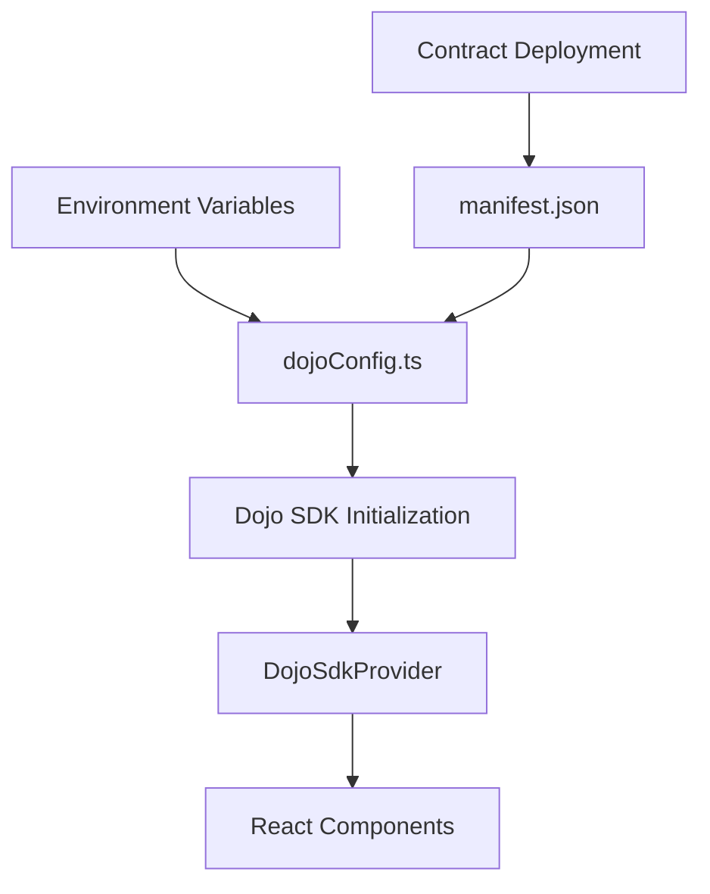

# React Integration - Dojo Config

The `dojoConfig.ts` file is the central configuration hub that connects your React application to the Dojo Engine infrastructure. This file orchestrates the connection between your frontend and the blockchain, handling everything from RPC endpoints to indexer connections.

## 🎯 What is dojoConfig?

The `dojoConfig` object created by `createDojoConfig` serves as the single source of truth for all Dojo-related settings in your React application. It configures:

- **Blockchain connectivity** through Starknet RPC endpoints
- **Data indexing** via Torii GraphQL servers  
- **Contract deployment** information through manifest files
- **Administrative accounts** for development and testing

Think of it as the bridge that connects your React components to the onchain game world.

## 📋 Complete File Structure

Here's the complete `dojoConfig.ts` file from a production implementation:

```typescript
import { createDojoConfig } from "@dojoengine/core";
import { manifest } from "../config/manifest";

const {
    VITE_PUBLIC_NODE_URL,
    VITE_PUBLIC_TORII,
    VITE_PUBLIC_MASTER_ADDRESS,
    VITE_PUBLIC_MASTER_PRIVATE_KEY,
  } = import.meta.env;

export const dojoConfig = createDojoConfig({
    manifest,
    masterAddress: VITE_PUBLIC_MASTER_ADDRESS || '',
    masterPrivateKey: VITE_PUBLIC_MASTER_PRIVATE_KEY || '',
    rpcUrl: VITE_PUBLIC_NODE_URL || '',
    toriiUrl: VITE_PUBLIC_TORII || '',
});
```

## 📦 Required Dependencies

Before creating your `dojoConfig.ts`, ensure you have the necessary packages installed:

```bash
# Core Dojo Engine packages
pnpm install @dojoengine/core @dojoengine/sdk

# For React integration 
pnpm install @dojoengine/sdk/react

# Starknet dependencies
pnpm install starknet

# Additional utilities (if needed)
pnpm install @dojoengine/utils
```

### Package Versions
Make sure you're using compatible versions. Check the [Dojo release notes](https://github.com/dojoengine/dojo/releases) for the latest stable versions:

```json
{
  "dependencies": {
    "@dojoengine/core": "^1.1.1",
    "@dojoengine/sdk": "^1.1.1", 
    "starknet": "^6.11.0"
  }
}
```

## 🔧 Configuration Parameters

### **manifest**
- **Type**: `Manifest` object (imported from config)
- **Purpose**: Contains all deployed contract addresses, ABIs, and world configuration
- **Source**: Auto-generated during Dojo deployment process

```typescript
// The manifest contains critical deployment information:
{
  world: {
    address: "0x...",      // World contract address
    class_hash: "0x..."    // World contract class hash
  },
  contracts: [...],        // All deployed system contracts
  models: [...]           // All registered model schemas
}
```

### **rpcUrl**
- **Environment Variable**: `VITE_PUBLIC_NODE_URL`
- **Purpose**: Direct connection to Starknet network for transaction submission
- **Examples**:
  - Localhost: `http://localhost:5050` (Katana)
  - Sepolia: `https://api.cartridge.gg/x/starknet/sepolia`
  - Mainnet: `https://api.cartridge.gg/x/starknet/mainnet`

### **toriiUrl**
- **Environment Variable**: `VITE_PUBLIC_TORII`
- **Purpose**: GraphQL endpoint for efficient blockchain data querying
- **Why Important**: Torii indexes all game events and state changes, making data retrieval much faster than direct RPC calls
- **Examples**:
  - Local: `http://localhost:8080`
  - Hosted: `https://api.cartridge.gg/x/your-project/torii`

### **masterAddress**
- **Environment Variable**: `VITE_PUBLIC_MASTER_ADDRESS`
- **Purpose**: Administrative account address for contract deployment and management
- **Security**: Only required for development environments
- **Production**: Should be empty or omitted in production builds

### **masterPrivateKey**
- **Environment Variable**: `VITE_PUBLIC_MASTER_PRIVATE_KEY`
- **Purpose**: Private key for the master account
- **⚠️ Security Warning**: Never commit this to version control. Development only!
- **Production**: Must be empty in production environments

## 🌍 Environment Configuration

### Development (.env.local)
```bash
# Katana (Local Development)
VITE_PUBLIC_DEPLOY_TYPE=localhost
VITE_PUBLIC_NODE_URL=http://localhost:5050
VITE_PUBLIC_TORII=http://localhost:8080
VITE_PUBLIC_MASTER_ADDRESS=0x517ececd29116499f4a1b...
VITE_PUBLIC_MASTER_PRIVATE_KEY=0x1800000000300...
```

### Sepolia Testnet (.env.local)
```bash
# Sepolia Testnet
VITE_PUBLIC_DEPLOY_TYPE=sepolia
VITE_PUBLIC_NODE_URL=https://api.cartridge.gg/x/starknet/sepolia
VITE_PUBLIC_TORII=https://api.cartridge.gg/x/your-project/torii
VITE_PUBLIC_MASTER_ADDRESS=0x your_sepolia_account_address
VITE_PUBLIC_MASTER_PRIVATE_KEY=0x your_sepolia_private_key
```

### Production Mainnet (.env.production)
```bash
# Mainnet Production
VITE_PUBLIC_DEPLOY_TYPE=mainnet
VITE_PUBLIC_NODE_URL=https://api.cartridge.gg/x/starknet/mainnet
VITE_PUBLIC_TORII=https://api.cartridge.gg/x/your-project/torii
# Note: Master keys should be empty in production
VITE_PUBLIC_MASTER_ADDRESS=
VITE_PUBLIC_MASTER_PRIVATE_KEY=
```

## 🔥 Advanced Configuration Patterns

### Dynamic Configuration with Fallbacks

```typescript
// dojoConfig.ts - Production-ready with comprehensive fallbacks
import { createDojoConfig } from "@dojoengine/core";
import { manifest } from "../config/manifest";

const {
  VITE_PUBLIC_NODE_URL,
  VITE_PUBLIC_TORII,
  VITE_PUBLIC_MASTER_ADDRESS,
  VITE_PUBLIC_MASTER_PRIVATE_KEY,
  VITE_PUBLIC_DEPLOY_TYPE = 'sepolia', // Default fallback
} = import.meta.env;

// Network-specific defaults
const networkDefaults = {
  localhost: {
    rpcUrl: 'http://localhost:5050',
    toriiUrl: 'http://localhost:8080',
  },
  sepolia: {
    rpcUrl: 'https://api.cartridge.gg/x/starknet/sepolia',
    toriiUrl: 'https://api.cartridge.gg/x/your-project/torii',
  },
  mainnet: {
    rpcUrl: 'https://api.cartridge.gg/x/starknet/mainnet',
    toriiUrl: 'https://api.cartridge.gg/x/your-project-prod/torii',
  },
} as const;

const currentNetwork = networkDefaults[VITE_PUBLIC_DEPLOY_TYPE as keyof typeof networkDefaults];

export const dojoConfig = createDojoConfig({
  manifest,
  masterAddress: VITE_PUBLIC_MASTER_ADDRESS || '',
  masterPrivateKey: VITE_PUBLIC_MASTER_PRIVATE_KEY || '',
  rpcUrl: VITE_PUBLIC_NODE_URL || currentNetwork?.rpcUrl || networkDefaults.sepolia.rpcUrl,
  toriiUrl: VITE_PUBLIC_TORII || currentNetwork?.toriiUrl || networkDefaults.sepolia.toriiUrl,
});

// Export additional network info for debugging
export const networkInfo = {
  deployType: VITE_PUBLIC_DEPLOY_TYPE,
  isLocalhost: VITE_PUBLIC_DEPLOY_TYPE === 'localhost',
  isProduction: VITE_PUBLIC_DEPLOY_TYPE === 'mainnet',
  worldAddress: manifest.world.address,
};
```

### Type-Safe Configuration with Validation

```typescript
// types/config.ts - Configuration type definitions
export interface NetworkConfig {
  rpcUrl: string;
  toriiUrl: string;
  chainId: 'KATANA' | 'SN_SEPOLIA' | 'SN_MAIN';
  name: string;
}

export type DeploymentType = 'localhost' | 'sepolia' | 'mainnet';

// config/validator.ts - Runtime validation
export function validateConfig() {
  const required = [
    'VITE_PUBLIC_NODE_URL',
    'VITE_PUBLIC_TORII',
  ];
  
  const missing = required.filter(key => !import.meta.env[key]);
  
  if (missing.length > 0) {
    throw new Error(`Missing required environment variables: ${missing.join(', ')}`);
  }
  
  // Validate URLs
  try {
    new URL(import.meta.env.VITE_PUBLIC_NODE_URL);
    new URL(import.meta.env.VITE_PUBLIC_TORII);
  } catch (error) {
    throw new Error('Invalid URL format in environment variables');
  }
}
```

## 📊 Manifest Integration

The `dojoConfig` relies heavily on the manifest file, which contains deployment-specific information:

```typescript
// config/manifest.ts - Multi-environment manifest management
import localhost from "../../../contract/manifest_dev.json";
import sepolia from "./manifest_sepolia.json";
import mainnet from "./manifest_mainnet.json";

const manifests = {
  localhost,
  sepolia,
  mainnet,
};

// Automatic selection based on environment
const deployType = import.meta.env.VITE_PUBLIC_DEPLOY_TYPE;
export const manifest = deployType in manifests 
  ? manifests[deployType as keyof typeof manifests]
  : sepolia; // fallback
```

## 🔒 Security Best Practices

### Environment Variable Security
- **VITE_PUBLIC_** prefix is required for Vite to expose variables to client
- **Never commit** `.env.local` files to version control
- **Rotate keys** regularly in development environments
- **Use empty strings** for master credentials in production

### Production Checklist
```typescript
// ✅ Good - Production safe configuration
export const dojoConfig = createDojoConfig({
    manifest,
    masterAddress: '', // Empty in production
    masterPrivateKey: '', // Empty in production
    rpcUrl: VITE_PUBLIC_NODE_URL || 'https://api.cartridge.gg/x/starknet/mainnet',
    toriiUrl: VITE_PUBLIC_TORII || 'https://api.cartridge.gg/x/production/torii',
});
```

## 🛠️ How to Obtain Configuration Values

### For Katana (Local Development)
1. Start Katana: `katana --config katana.toml`
2. Default RPC: `http://localhost:5050`
3. Deploy contracts: `sozo migrate`
4. Start Torii: `torii --world <WORLD_ADDRESS>`
5. Default Torii: `http://localhost:8080`

### For Sepolia Testnet
1. Deploy to Sepolia: `sozo migrate --profile sepolia`
2. Use Cartridge RPC: `https://api.cartridge.gg/x/starknet/sepolia`
3. Deploy Torii instance via Slot: `slot deployments create`
4. Fund account from [Starknet Faucet](https://starknet-faucet.vercel.app/)

### For Mainnet
1. Deploy with production account: `sozo migrate --profile mainnet`
2. Use production RPC endpoints
3. Set up production Torii indexer
4. Never include master keys in production builds

## 🔄 Configuration Flow



1. **Environment variables** provide network-specific settings
2. **dojoConfig.ts** combines variables with manifest data
3. **Dojo SDK** uses config for initialization
4. **React providers** distribute config throughout app
5. **Components** access blockchain through configured SDK

## 🎮 Practical Usage Examples

### Using dojoConfig in Custom Hooks

```typescript
// hooks/usePlayer.tsx
import { useAccount } from "@starknet-react/core";
import { dojoConfig } from "../dojo/dojoConfig";

export function usePlayer() {
  const { address } = useAccount();
  
  // Use Torii GraphQL endpoint from config
  const TORII_URL = dojoConfig.toriiUrl + "/graphql";
  
  const fetchPlayer = async () => {
    const response = await fetch(TORII_URL, {
      method: 'POST',
      headers: { 'Content-Type': 'application/json' },
      body: JSON.stringify({
        query: `
          query GetPlayer($playerOwner: ContractAddress!) {
            playerModels(where: { owner: $playerOwner }) {
              edges { node { owner experience health coins } }
            }
          }
        `,
        variables: { playerOwner: address }
      })
    });
    
    return response.json();
  };
  
  return { fetchPlayer };
}
```

### Environment-Aware Component

```typescript
// components/NetworkStatus.tsx  
import { dojoConfig } from "../dojo/dojoConfig";

export function NetworkStatus() {
  const { VITE_PUBLIC_DEPLOY_TYPE } = import.meta.env;
  
  return (
    <div className="network-info">
      <p>Network: {VITE_PUBLIC_DEPLOY_TYPE}</p>
      <p>RPC: {dojoConfig.rpcUrl}</p>
      <p>Torii: {dojoConfig.toriiUrl}</p>
      <p>World: {dojoConfig.manifest.world.address}</p>
    </div>
  );
}
```

## 🎯 Common Troubleshooting

### "Failed to initialize Dojo SDK"
- Check that `VITE_PUBLIC_TORII` URL is accessible
- Verify `manifest.world.address` exists on the target network
- Ensure RPC endpoint is responding

### "Network mismatch" errors
- Confirm `VITE_PUBLIC_DEPLOY_TYPE` matches your target network
- Verify manifest file corresponds to the correct deployment
- Check that wallet is connected to the same network

### Missing environment variables
- All `VITE_PUBLIC_*` variables must be defined before build
- Use fallback values in `dojoConfig` for required fields
- Check `.env.local` file is in the correct directory

---

The `dojoConfig.ts` file is your gateway to the Dojo ecosystem. By properly configuring this file, you ensure smooth communication between your React frontend and the blockchain infrastructure, enabling seamless onchain gaming experiences.

**Next step**: Learn how to integrate this configuration with [Starknet Provider](/integrations/react/starknet-provider) for wallet connectivity.

## 🚀 Quick Setup Guide

### Step-by-Step Implementation

**1. Install Dependencies**
```bash
pnpm install @dojoengine/core @dojoengine/sdk starknet
```

**2. Create Configuration File**
```bash
# Create the config directory structure
mkdir -p src/dojo src/config

# Create dojoConfig.ts
touch src/dojo/dojoConfig.ts
```

**3. Set Up Environment Variables**
```bash
# Create .env.local file
echo "VITE_PUBLIC_DEPLOY_TYPE=sepolia
VITE_PUBLIC_NODE_URL=https://api.cartridge.gg/x/starknet/sepolia
VITE_PUBLIC_TORII=https://api.cartridge.gg/x/your-project/torii
VITE_PUBLIC_MASTER_ADDRESS=
VITE_PUBLIC_MASTER_PRIVATE_KEY=" > .env.local
```

**4. Copy the Basic Configuration**
```typescript
// src/dojo/dojoConfig.ts
import { createDojoConfig } from "@dojoengine/core";
import { manifest } from "../config/manifest";

const {
  VITE_PUBLIC_NODE_URL,
  VITE_PUBLIC_TORII,
  VITE_PUBLIC_MASTER_ADDRESS,
  VITE_PUBLIC_MASTER_PRIVATE_KEY,
} = import.meta.env;

export const dojoConfig = createDojoConfig({
  manifest,
  masterAddress: VITE_PUBLIC_MASTER_ADDRESS || '',
  masterPrivateKey: VITE_PUBLIC_MASTER_PRIVATE_KEY || '',
  rpcUrl: VITE_PUBLIC_NODE_URL || '',
  toriiUrl: VITE_PUBLIC_TORII || '',
});
```

**5. Test Your Configuration**
```typescript
// Add this to your main.tsx to test the config
console.log('🔧 Dojo Config:', {
  rpcUrl: dojoConfig.rpcUrl,
  toriiUrl: dojoConfig.toriiUrl,
  worldAddress: dojoConfig.manifest.world.address,
});
```

### Common First-Time Issues

**❌ "Cannot read properties of undefined"**
- Missing manifest file - ensure your contracts are deployed and manifest is generated

**❌ "Network connection failed"**  
- Check RPC URL is accessible from your browser
- Verify CORS settings for local development

**❌ "Torii GraphQL endpoint not found"**
- Confirm Torii indexer is running and accessible
- Check the `/graphql` endpoint is responsive

**✅ Success Indicators**
- No console errors during SDK initialization
- `dojoConfig.manifest.world.address` shows a valid contract address
- Network status component displays correct values

---

🎯 **Ready to continue?** Now that your `dojoConfig` is set up, proceed to configure the [Starknet Provider](/integrations/react/starknet-provider) for wallet integration!